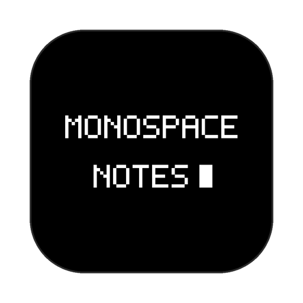
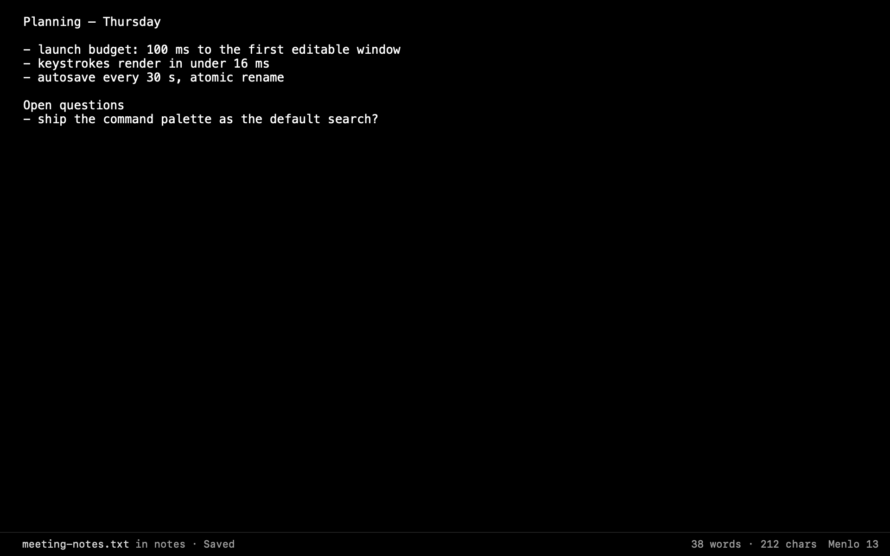
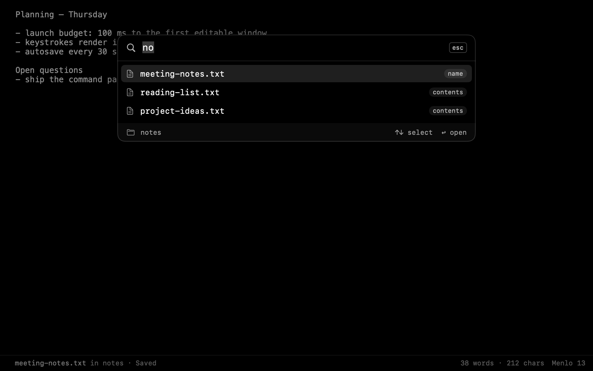
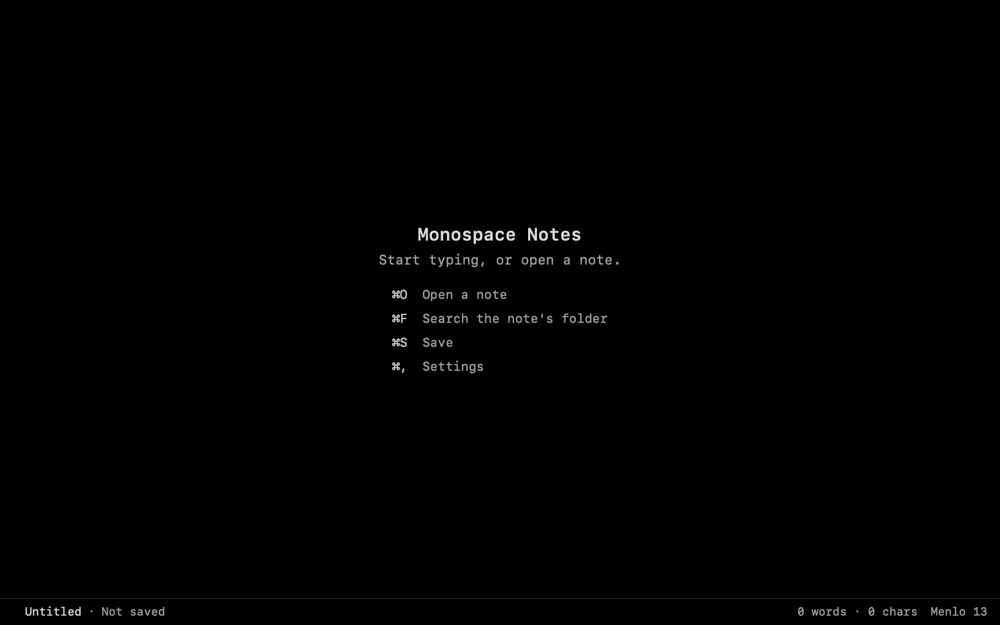
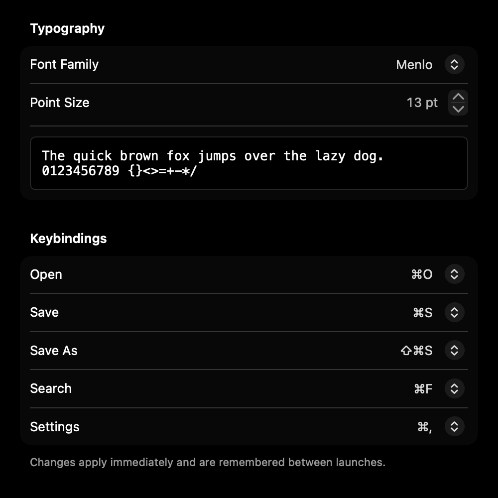

# Monospace Notes

<p align="center">
  
</p>

<p align="center">
  <strong>A fast, dark, keyboard-first plain-text note editor for macOS. One window, one monospace font, your <code>.txt</code> files on disk.</strong>
</p>

<p align="center">
  
  
  
  
  
</p>

<p align="center">
  
</p>

---

## Overview

Monospace Notes opens a plain-text note, lets you type into it with no lag, and saves it back to the same file. There is no library, no database and no sync: a note is an ordinary UTF-8 `.txt` file wherever you keep it, and the folder it lives in is the folder you search.

The window is black (`#000000`) with a high-contrast monospace foreground (at least 7:1). Everything else stays out of the way until you ask for it.

## Features

- **TextKit 2 editor.** A native `NSTextView` on TextKit 2, measured against a 16 ms keystroke-to-screen budget. Undo, cut, delete, selection replacement and scrolling all behave as in any Mac text view. Smart quotes, dashes and text replacement are off, so the file holds exactly what you typed.
- **Safe saving.**
  - `⌘S` saves to the note's own path; an untitled note gets a save panel first.
  - `⇧⌘S` saves a copy under a new name.
  - Every write goes to a temporary file in the same folder and is renamed over the original, so a failed save never leaves a half-written note.
- **Background autosave.** 30 seconds after your last edit, the note is saved off the main thread with the same atomic writer. A failed autosave shows in the status bar and never interrupts you with a dialog.
- **Search palette.** `⌘F` fuzzy-searches the file names and contents of the notes in the open note's folder, ranked by match quality. `↑` and `↓` select a result, `↩` opens it, and `esc` returns to your note.
- **Status bar.** Shows the note and its folder, whether it is saved or edited, the latest status message, word and character counts, and the current font.
- **Settings.** Choose the font family and size, with a live preview, and remap Open, Save, Save As, Search and Settings. Changes apply immediately and persist in `UserDefaults`.
- **Private by construction.** The app has no network code (a test scans the source tree for network APIs), no telemetry, no third-party packages, and no entitlements beyond an empty set.
- **Accessible.** Every control has a VoiceOver label. `Scripts/ax_audit.swift` checks the running app's accessibility tree.

<p align="center">
  
</p>

<table>
  <tr>
    <td></td>
    <td></td>
  </tr>
</table>

## Keyboard shortcuts

| Action | Default |
| --- | --- |
| Open a note | `⌘O` |
| Save | `⌘S` |
| Save As | `⇧⌘S` |
| Search the note's folder | `⌘F` |
| Settings | `⌘,` |

All five can be remapped in Settings; the menus and the empty-window hint follow your choices.

## Build and run

Requirements: macOS 14 or later on Apple silicon, and Swift 6 (Xcode 16 or later, or a Swift 6 toolchain).

```bash
git clone https://github.com/nodaysidle/monospace-notes.git
cd monospace-notes
swift run -c release
```

To build the app bundle and a DMG:

```bash
./Scripts/package_app.sh
```

This writes `dist/Monospace Notes.app` and `dist/Monospace Notes.dmg`. The bundle is signed with a Developer ID when one is available, ad-hoc otherwise, and must pass `codesign --verify --deep --strict` before the DMG is made. The script never installs anything; copy the app to `/Applications` yourself.

## Tests

```bash
./Scripts/test.sh                                      # 241 Swift Testing tests + the release test build
swift Scripts/ax_audit.swift "dist/Monospace Notes.app"   # accessibility audit of the running app
```

The audit needs Accessibility permission for your terminal (System Settings > Privacy & Security > Accessibility).

## Performance

The spec budgets 100 ms for the cold launch, measured in-process from initialization to the first editable window. On an Apple silicon Mac that takes about 80 ms. From process start to the window appearing on screen it takes about 180 ms, against 130–150 ms for an empty SwiftUI window on the same machine, so most of that time is the platform's own startup.

## Project layout

```
Sources/MonospaceNotes/
  MonospaceNotesApp.swift   App entry, window, Settings scene, menu commands
  AppState.swift            Composition root and shared types
  Features/                 One file per feature: editor, save, autosave, search, settings…
  Interface/                Window chrome: status bar, empty-window hint, palette frame
  Platform/                 Atomic file store, permissions, app lifecycle
Tests/MonospaceNotesTests/  One focused suite per feature, plus contract tests
Scripts/                    package_app.sh, test.sh, ax_audit.swift
PRD.md ARD.md TRD.md TASKS.md AGENTS.md   The specification packet the app was built from
```

## How it was made

Monospace Notes was specified with [NODAYSIDLE Cascade V3](https://github.com/nodaysidle/nodaysidle-cascade-v3), a compiler that turns a product idea into a traceable packet: `PRD.md`, `ARD.md`, `TRD.md`, `TASKS.md` and `AGENTS.md`. Every feature in the packet has contracts, acceptance criteria and a task with a focused test suite. An agent delegation workflow implemented the packet task by task. A review pass then:

- fixed editing bugs the per-task gates had missed (delete and selection replacement, scrolling);
- moved the launch measurement onto the real document view;
- added the search palette, status bar, empty-window hint and Settings form;
- added the accessibility audit.

The packet files at the root of this repository are the specification the code is checked against.
